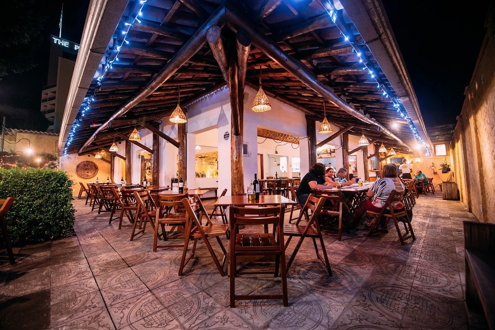

# meuvaledoaco

## Descrição do Projeto

O **Meu Vale do Aço** é uma plataforma web desenvolvida para catalogar e apresentar as melhores opções de restaurantes, bares e cafés nas principais cidades do Vale do Aço, como Coronel Fabriciano, Ipatinga e Timóteo. O projeto permite que os usuários se cadastrem, façam login, e explorem sugestões de estabelecimentos para desfrutar de uma experiência gastronômica única.

## Funcionalidades

- **Cadastro de Usuário**: Permite que novos usuários se cadastrem na plataforma.
- **Login de Usuário**: Usuários cadastrados podem fazer login para acessar funcionalidades personalizadas.
- **Exploração de Cidades**: Listagem de cidades e seus principais restaurantes, bares e cafés.
- **Avaliação de Estabelecimentos**: Usuários podem avaliar os estabelecimentos com notas de 1 a 5 estrelas.
- **Persistência de Dados**: Utiliza `LocalStorage` e `SessionStorage` para salvar dados dos usuários.

## Demonstração

### Página Inicial (Landing Page)

### Página de Cadastro

### Página de Login

### Página Inicial (Home)

### Página de Listagem de Restaurantes
